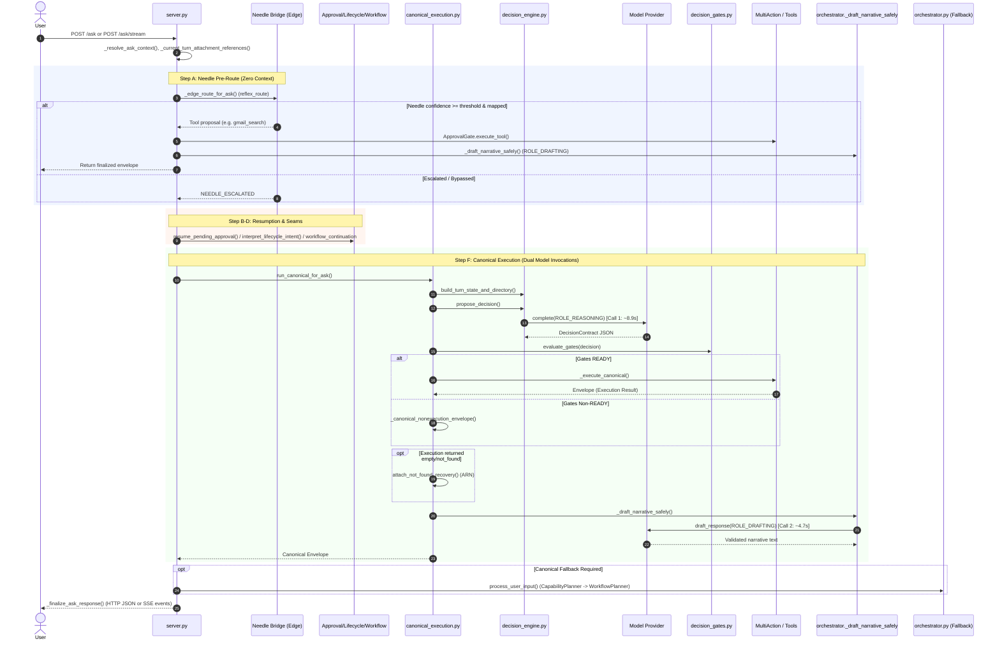
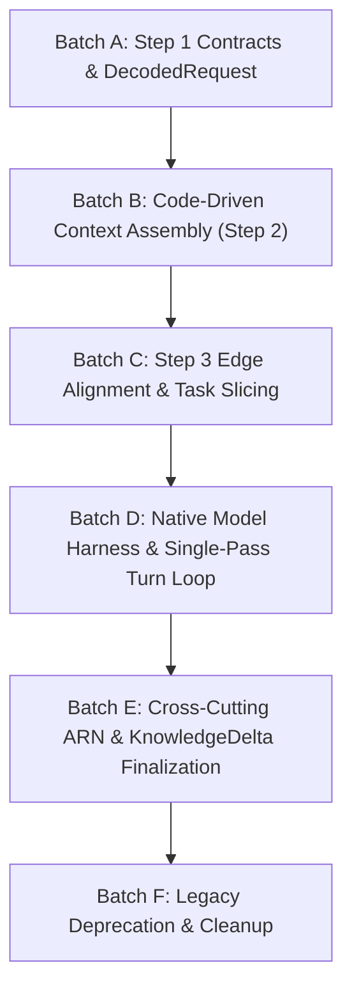

# URI — New Architecture Audit & Source Map

**Audit Status:** COMPLETE (READ-ONLY)  
**Date:** 2026-09-21  
**Auditor:** Antigravity (Repository Auditor & Architecture Mapper)  
**Repository Branch:** `master`  
**HEAD Commit:** `e8e3b65259c45fc823addc3ef8969425a265bd1b`  
**Working-Tree Status:** Dirty (retaining uncommitted M33.3 Fix A telemetry reconciliation and prior milestone test/doc artifacts; no production files modified, committed, or pushed during this audit)

---

## 1. Executive Summary

This read-only architecture audit inspects the current reality of the `uri-agent` codebase against the **Approved Target Architecture**:

```text
USER ──► STEP 1 (Semantic Decoding: Needle 3) ──► DecodedRequest
     ──► STEP 2 (Context Resolution / Assembly: Code-Driven) ──► ContextPack
     ──► STEP 3 (Edge Intelligence: Needle 3) ──► [HANDLE / ESCALATE]
     ──► LOCAL AGENTIC TIER (Optional 2B–4B Model) ──► [HANDLE / ESCALATE]
     ──► EXTENDED INTELLIGENCE (Claude / GPT / Gemini / Large Local)
     ──► FINALIZATION + STATE COMMIT + KNOWLEDGE BUILDING (KnowledgeDelta ──► Graphify)
```

### Core Audit Findings
1. **High Infrastructure Reusability (~75%):**
   URI does not need to be rewritten from scratch. It already possesses robust, modular infrastructure:
   - SQLite-backed per-user knowledge graph (`GraphStore`, `GraphEngine` in [`uri_core/core/graph_store.py`](file:///C:/Users/cheta/Development/uri-agent/uri_core/core/graph_store.py)).
   - System-wide cognitive index ([`uri_core/core/graphify_index.py`](file:///C:/Users/cheta/Development/uri-agent/uri_core/core/graphify_index.py)).
   - Provider-neutral model interaction layer with Ollama, OpenAI-compatible, and Anthropic backends ([`uri_core/core/model_providers/`](file:///C:/Users/cheta/Development/uri-agent/uri_core/core/model_providers/)).
   - Production-ready native tool loop and streaming SSE handler ([`uri_core/core/native_tool_loop.py`](file:///C:/Users/cheta/Development/uri-agent/uri_core/core/native_tool_loop.py), [`uri_core/core/stream_tool_loop.py`](file:///C:/Users/cheta/Development/uri-agent/uri_core/core/stream_tool_loop.py)).
   - Multi-action capability registry, dispatcher, and executor ([`uri_core/capabilities/`](file:///C:/Users/cheta/Development/uri-agent/uri_core/capabilities/)).
   - Deterministic safety gates and approval persistence ([`uri_core/core/decision_gates.py`](file:///C:/Users/cheta/Development/uri-agent/uri_core/core/decision_gates.py), [`uri_core/core/approval_store.py`](file:///C:/Users/cheta/Development/uri-agent/uri_core/core/approval_store.py)).
   - Structured ARN recovery data models and cost accounting ([`uri_core/core/arn/`](file:///C:/Users/cheta/Development/uri-agent/uri_core/core/arn/)).
   - Subprocess-isolated Needle reflex bridge ([`uri_core/core/edge/adapters/ensemble.py`](file:///C:/Users/cheta/Development/uri-agent/uri_core/core/edge/adapters/ensemble.py)).

2. **Primary Architectural Conflicts & Impediments:**
   - **Semantic Decoding Entanglement:** Current URI mixes intent understanding, capability routing, parameter estimation, and mode prediction into a single monolithic prompt (`DECISION_CONTRACT_SYSTEM_PROMPT` in [`decision_engine.py`](file:///C:/Users/cheta/Development/uri-agent/uri_core/core/decision_engine.py)), or tries to guess tool dispatch via zero-context regexes in [`server.py`](file:///C:/Users/cheta/Development/uri-agent/uri_core/app/server.py).
   - **Mandatory Dual-Call Main Brain Bottleneck:** As confirmed in source, canonical execution dispatches two sequential Main Brain calls per turn: `ROLE_REASONING` (`propose_decision`) followed by `ROLE_DRAFTING` (`_draft_narrative_safely`), inducing severe latency (~13.6s model time on local Ollama) and lowest-common-denominator prompt constraints.
   - **Suppressed Native Capabilities:** Advanced model capabilities (multi-tool calls, parallel tool execution, streaming agent loops) were already written in M32 Batch C ([`native_tool_loop.py`](file:///C:/Users/cheta/Development/uri-agent/uri_core/core/native_tool_loop.py)), but sit disabled behind `URI_ENABLE_NATIVE_TOOL_LOOP=0`.
   - **Dormant Knowledge Graph Feedback:** `GraphStore` and `GraphEngine` are fully implemented, but `ingest_fact()` is dormant because `Fact.verify()` is never called in live turns. No automated `KnowledgeDelta` is committed upon turn completion.
   - **Premature Edge Reflex Execution:** Needle currently runs *before* context resolution, with only raw user text, evaluated against a hardcoded two-tool dictionary.

---

## 2. Current Request Lifecycle (Source-Grounded)

The live entry point for user prompts is [`uri_core/app/server.py`](file:///C:/Users/cheta/Development/uri-agent/uri_core/app/server.py) (`ask()` and `ask_stream()`).



### Turn Step Details
1. **Request Intake & Context Resolution (`server.py:1860-1868`):**
   - Extracts session ID and authenticated user ID.
   - Calls `_resolve_ask_context()` to instantiate/load `UserContext`, `Session`, `Principal`, and `personalization_context`.
   - Resolves active attachments staged in `FileStore` via `_current_turn_attachment_references()`.
2. **Edge Pre-Route Attempt (`server.py:1869-1880`, `_edge_route_for_ask`):**
   - If Edge is disabled or user supplied `model_override`, bypasses to Main Brain.
   - Evaluates preflight keywords (`"hello"`, `"hi"`, `"help"`, `"ping"`).
   - If enabled, invokes `NeedleSubprocessAdapter` via IPC passing `{"operation": "reflex_route", "input": text}`.
   - If confidence meets threshold and capability maps to `_NEEDLE_CAPABILITY_MAP`, directly invokes `approval_gate.execute_tool()`, drafts narrative, and returns. Otherwise, emits `NEEDLE_ESCALATED`.
3. **Deterministic Seams (`server.py:1882-1956`):**
   - `resume_pending_approval`: Matches pending approval actions (e.g. user replied "yes").
   - `interpret_lifecycle_intent`: Regex parser for external integrations (`"enable skill..."`, `"connect service..."`).
   - `workflow_continuation`: Resumes paused workflows.
4. **Native Tool Loop Check (`server.py:1996-2028`):**
   - Checks `native_tool_loop_enabled()`. **Default: OFF (`URI_ENABLE_NATIVE_TOOL_LOOP` unset)**.
5. **Canonical Execution Path (`server.py:2029-2067` -> `canonical_execution.py:603-789`):**
   - `build_turn_state_and_directory()`: Gathers conversation history, session facts, and capability summaries.
   - `propose_decision()`: Sends prompt to Main Brain under `ROLE_REASONING` (`DECISION_CONTRACT_SYSTEM_PROMPT`). Parses JSON Decision Contract (`mode`, `capability`, `actions`, `clarification`).
   - `evaluate_gates()`: Deterministically verifies parameters, permissions, connections, and approvals.
   - `_execute_canonical()`: Calls `MultiActionDispatch` or legacy tool dispatcher.
   - ARN Integration (`canonical_execution.py:724-730`): If execution result status is `not_found`, invokes `attach_not_found_recovery()` to tag envelope.
   - Narrative Drafting (`canonical_execution.py:771-774` -> `orchestrator._draft_narrative_safely`): Calls Main Brain under `ROLE_DRAFTING` via `draft_response()`.
   - Session Persistence: `orchestrator._persist_session(session_id)`.
6. **Legacy Fallback (`server.py:2068-2070`):**
   - If canonical returns `_canonical_fallback`, calls `context.orchestrator.process_user_input()`.

---

## 3. Current Architecture Diagram

```text
                                  ┌──────────────────────────────────────────────────────────┐
                                  │                     POST /ask /ask/stream                │
                                  └─────────────────────────────┬────────────────────────────┘
                                                                │
                                                                ▼
                                  ┌──────────────────────────────────────────────────────────┐
                                  │          server.py: _edge_route_for_ask()                │
                                  │      (Needle Reflex Bridge: Raw Text Only)               │
                                  └───────────────┬──────────────────────────┬───────────────┘
                                                  │                          │
                                            [Confidence >= Thresh]     [Escalated / Bypassed]
                                                  │                          │
                                                  ▼                          ▼
                                       ┌──────────────────────┐   ┌──────────────────────────┐
                                       │ Direct Tool Dispatch │   │ Approval / Lifecycle     │
                                       │   ApprovalGate       │   │ Continuation Seams       │
                                       └──────────┬───────────┘   └──────────┬───────────────┘
                                                  │                          │
                                                  ▼                          ▼
                                       ┌──────────────────────┐   ┌──────────────────────────┐
                                       │ _draft_narrative()   │   │ Native Tool Loop (M32 C) │
                                       │   (Main Brain)       │   │ [DISABLED BY DEFAULT]    │
                                       └──────────┬───────────┘   └──────────┬───────────────┘
                                                  │                          │ (off)
                                                  │                          ▼
                                                  │               ┌──────────────────────────┐
                                                  │               │ CANONICAL EXECUTION      │
                                                  │               │ canonical_execution.py   │
                                                  │               └──────────┬───────────────┘
                                                  │                          │
                                                  │                          ▼
                                                  │               ┌──────────────────────────┐
                                                  │               │ CALL 1: ROLE_REASONING   │
                                                  │               │ propose_decision()       │
                                                  │               │ (Main Brain - JSON mode) │
                                                  │               └──────────┬───────────────┘
                                                  │                          │
                                                  │                          ▼
                                                  │               ┌──────────────────────────┐
                                                  │               │ Deterministic Gates      │
                                                  │               │ evaluate_gates()         │
                                                  │               └──────────┬───────────────┘
                                                  │                          │
                                                  │                          ▼
                                                  │               ┌──────────────────────────┐
                                                  │               │ Tool / Multi-Action      │
                                                  │               │ Execution Dispatch       │
                                                  │               └──────────┬───────────────┘
                                                  │                          │
                                                  │                          ▼
                                                  │               ┌──────────────────────────┐
                                                  │               │ ARN Recovery Check       │
                                                  │               │ (if not_found result)    │
                                                  │               └──────────┬───────────────┘
                                                  │                          │
                                                  │                          ▼
                                                  │               ┌──────────────────────────┐
                                                  │               │ CALL 2: ROLE_DRAFTING    │
                                                  │               │ _draft_narrative_safely()│
                                                  │               │ (Main Brain - Narrative) │
                                                  │               └──────────┬───────────────┘
                                                  │                          │
                                                  ▼                          ▼
                                  ┌──────────────────────────────────────────────────────────┐
                                  │                _finalize_ask_response()                  │
                                  │      (Telemetry, Duration, JSON/SSE Delivery)           │
                                  └──────────────────────────────────────────────────────────┘
```

---

## 4. Target Architecture Mapping

| Approved Target Architecture Stage | Target Responsibility | Current Reality in URI Source | Architectural Gap / Action |
| :--- | :--- | :--- | :--- |
| **Step 1: Semantic Request Decoding** | Needle 3 decodes user intent into `DecodedRequest` (intent, references, dependencies, ambiguities). No tool picking, no Graphify search. | Split across regexes in `server.py`, `conversational_classifier.py`, and monolithic `propose_decision` in `decision_engine.py`. | **BUILD NEW CONTRACT**: Create `DecodedRequest` dataclass; retarget Needle 3 bridge from tool routing to pure semantic decoding. |
| **Step 2: Context Resolution & Assembly** | Code-driven resolution: (1) Current turn, (2) Same-session context, (3) Active session state, (4) Graphify persistent context, (5) ARN if unresolved -> `ContextPack`. | Scattered across `turn_state.py`, `query_context.py`, `personalization_context.py`. No systematic reference resolver. | **BUILD CODE-DRIVEN PIPELINE**: Implement `ContextResolver` assembling `ContextPack` adhering to strict priority cascade; integrate `GraphStore` and `GraphifyIndex`. |
| **Step 3: Edge Intelligence** | Needle 3 receives *minimum task-relevant slice* of `ContextPack`. Handles lightweight execution (`EDGE_REPLY`, `EXECUTE_PROPOSAL`) or escalates. | `_edge_route_for_ask` runs at Step 0 before context assembly, with no context, matching a 2-tool hardcoded map. | **MOVE & MODIFY**: Relocate Needle tool proposal after Step 2; feed task-relevant context slice; expand capabilities. |
| **Local Agentic Tier** | Optional 2B–4B agentic model (Qwen 2.5 / Gemma 3) doing native multi-step reasoning, tool execution, or escalating. | Provider infrastructure exists (`OllamaProvider`, `OpenAICompatibleProvider`), but no dedicated local agent role or routing tier. | **WIRE ROLE**: Bind `ROLE_LOCAL_AGENT` to `ModelRouter` and connect to `native_tool_loop.py`. |
| **Extended Intelligence** | Claude / GPT / Gemini / Large Local receives full `ContextPack` directly without compression; unconstrained native tool loops. | Main Brain is artificially constrained to `DECISION_CONTRACT_SYSTEM_PROMPT` + dual sequential calls (`propose_decision` + `_draft_narrative_safely`). | **UNCONSTRAIN**: Retire dual-call pattern; enable native tool loop (`native_tool_loop.py`) with direct streaming. |
| **Finalization & Knowledge Building** | Provenance tracking, artifact generation, state commit, and `KnowledgeDelta` feedback loop committed to `GraphStore`. | Finalization only serializes session JSON; `graph_ingest.py` is dormant because `Fact.verify()` is never called in live turns. | **ACTIVATE FEEDBACK**: Introduce `KnowledgeDelta` emitted upon turn completion to update `GraphStore` entities and relationships. |

---

## 5. Step 1 Audit — Semantic Request Decoding

### Target Concept: `DecodedRequest`
Must capture:
- **Core Intent Frame:** Goal, requested operations, supplied context, constraints, desired format, tone.
- **References:** Linguistic referents (`"this"`, `"that file"`, `"same"`, `"them"`, `"yesterday"`).
- **Dependencies:** Current-session, prior-session, attachment, persistent-context dependencies.
- **Interpretation State:** Unresolved references, ambiguities, confidence.

### Current Implementation Reality
Semantic decoding is currently fragmented and conflated across 5 separate places:
1. **Hardcoded String Matching ([`uri_core/app/server.py:1756-1758`](file:///C:/Users/cheta/Development/uri-agent/uri_core/app/server.py#L1756-L1758)):**
   Bypasses Needle for fixed keywords (`{"hello", "hi", "hey", "ping", "status", "help", "who are you", "what can you do"}`).
2. **Deterministic Lifecycle Parser ([`uri_core/core/lifecycle_intent_interpreter.py:35-80`](file:///C:/Users/cheta/Development/uri-agent/uri_core/core/lifecycle_intent_interpreter.py#L35-L80)):**
   Regex engine extracting `operation` (`"enable"`, `"disable"`) and `target_id` for skills/services.
3. **Conversational Classifier ([`uri_core/core/conversational_classifier.py:55-120`](file:///C:/Users/cheta/Development/uri-agent/uri_core/core/conversational_classifier.py#L55-L120)):**
   Regexes plus a gate checking `entities == []`, `requires_evidence == False`, `requires_clarification == False`.
4. **Provider Semantic Interpreter ([`uri_core/core/provider_semantic_interpreter.py:41-60`](file:///C:/Users/cheta/Development/uri-agent/uri_core/core/provider_semantic_interpreter.py#L41-L60)):**
   Legacy 8-key JSON schema (`goal`, `task_type`, `domain`, `entities`, `requested_output`, `requires_evidence`, `requires_clarification`, `suggested_next_step`). Largely bypassed in canonical execution.
5. **Monolithic Decision Contract ([`uri_core/core/decision_engine.py:95-170`](file:///C:/Users/cheta/Development/uri-agent/uri_core/core/decision_engine.py#L95-L170)):**
   `DECISION_CONTRACT_SYSTEM_PROMPT` forces the model to simultaneously decipher user intent, resolve active pointers, select capabilities from the directory, generate action inputs, and predict gate modes (`single_action`, `multi_action`, `clarification`, `approval_required`).

### Entanglement Finding
Current URI completely conflates *what the user means* with *which capability to call* and *how to format the parameters*. Step 1 in the target architecture isolates meaning decoding completely from execution authority.

---

## 6. Step 2 Audit — Context Resolution & Assembly

### Target Responsibility
A code-driven resolution pipeline prioritizing:
1. Current input
2. Recent same-session context
3. Active session state (active workflows, pending questions, staged attachments)
4. Persistent Graphify context (`GraphStore` entities/edges + `GraphifyIndex`)
5. ARN only if unresolved
Output: cohesive `ContextPack`.

### Current Code Inventory
- **Turn State Projection ([`uri_core/core/turn_state.py:24-90`](file:///C:/Users/cheta/Development/uri-agent/uri_core/core/turn_state.py#L24-L90)):
  Already projects read-only state: `turn`, `recent_conversation`, `active_pointer`, `attempt_history`, `session_facts`, `capability_summaries`, `runtime_health`, `durable_memory_relevant`, `graph_context`.
- **Conversation History ([`uri_core/core/conversation_history.py`](file:///C:/Users/cheta/Development/uri-agent/uri_core/core/conversation_history.py)):
  Stores turn history per session, rolling window retrieval.
- **Session State ([`uri_core/core/state.py:Session`](file:///C:/Users/cheta/Development/uri-agent/uri_core/core/state.py)):
  Tracks `active_workflow`, `active_workflow_status`, `active_workflow_question`, `fact_history`, `evidence_facts`.
- **File & Attachment Store ([`uri_core/core/file_store.py`](file:///C:/Users/cheta/Development/uri-agent/uri_core/core/file_store.py)):
  Session-scoped and user-scoped file registration, mime detection, storage paths.
- **Graphify Index ([`uri_core/core/graphify_index.py:55-100`](file:///C:/Users/cheta/Development/uri-agent/uri_core/core/graphify_index.py#L55-L100)):
  Fast system-level cognitive index (`uri_workspace/graphify_index.json`) mapping capabilities, skills, workflows, and memory pointers.
- **Knowledge Graph Store ([`uri_core/core/graph_store.py:65-150`](file:///C:/Users/cheta/Development/uri-agent/uri_core/core/graph_store.py#L65-L150)):
  SQLite-backed per-user store (`graph.sqlite3`) supporting nodes (`GraphNode`), edges (`GraphEdge`), provenance, and attributes.
- **Graph Engine ([`uri_core/core/graph_engine.py`](file:///C:/Users/cheta/Development/uri-agent/uri_core/core/graph_engine.py)):
  Neighbor queries, paths, impact analysis, subgraph bounded queries.
- **Context Budgeting ([`uri_core/core/context_budget.py`](file:///C:/Users/cheta/Development/uri-agent/uri_core/core/context_budget.py), [`context_trimmer.py`](file:///C:/Users/cheta/Development/uri-agent/uri_core/core/context_trimmer.py)):
  Token counting, priority section budget limits.

### Missing Component for Step 2
URI lacks an explicit **Referent Resolver**. If a user says *"convert that file"*, current URI relies on `read_attached_file` scanning the session attachments or the model guessing. A code-driven resolver matching `DecodedRequest.references` against `Session.attachments`, `recent_conversation`, and `GraphStore` entities does not yet exist.

---

## 7. ARN (Adaptive Recovery Network) Audit

### Location & Structure
ARN is cleanly factored in [`uri_core/core/arn/`](file:///C:/Users/cheta/Development/uri-agent/uri_core/core/arn/):
- [`models.py`](file:///C:/Users/cheta/Development/uri-agent/uri_core/core/arn/models.py): `ARNState`, `EvidenceItem`, `EvidenceCategory`, `SourceRecord`, `Candidate`, `EliminatedCandidate`, `UserClue`, `CostCeiling`, `CostAccumulator`, `ClarificationRecommendation`.
- [`engine.py`](file:///C:/Users/cheta/Development/uri-agent/uri_core/core/arn/engine.py): `ARNEngine`, search repetition checks, clue recording, cost tracking.
- [`integration.py`](file:///C:/Users/cheta/Development/uri-agent/uri_core/core/arn/integration.py): `is_not_found_result()`, `attach_not_found_recovery()`.

### Current Invocation & Scope
- Currently invoked **only** in [`canonical_execution.py:722-730`](file:///C:/Users/cheta/Development/uri-agent/uri_core/core/canonical_execution.py#L722-L730) when a tool execution returns an empty or `not_found` result.
- Converts the terminal failure into `status: "recovery_required"` with `arn_state` rendered on the UI.

### Generalization Potential & Gaps
- **Target Role:** ARN should be a **cross-cutting adaptive recovery path** activated when:
  1. Context resolution cannot resolve cross-session referents or entities.
  2. Missing document or inaccessible attachment source.
  3. Capability or integration disconnected / authentication required.
  4. Tool execution error or empty data.
- **Coupling:** Current ARN integration is purely post-execution. It needs a clean caller interface during Step 2 (Context Resolution) when referent resolution stalls.

---

## 8. Step 3 / Edge Intelligence Audit

### Location & Structure
Implemented under M33.2 in [`uri_core/core/edge/`](file:///C:/Users/cheta/Development/uri-agent/uri_core/core/edge/):
- [`contracts.py`](file:///C:/Users/cheta/Development/uri-agent/uri_core/core/edge/contracts.py): `EdgeIntelligenceProvider` protocol, `EdgeRequest`, `EdgeProposal`, `EdgeHealth`, `RuntimeInventory`, `VisionRequest`, `AudioRequest`, `EmbeddingRequest`, `NullEdgeProvider`.
- [`routing_policy.py`](file:///C:/Users/cheta/Development/uri-agent/uri_core/core/edge/routing_policy.py): `EdgeRoutingPolicy` (`EDGE_ONLY`, `EDGE_PREFERRED`, `MAIN_BRAIN_PREFERRED`, `BALANCED`).
- [`settings.py`](file:///C:/Users/cheta/Development/uri-agent/uri_core/core/edge/settings.py): `EdgeSettingsStore` persisted per-user (`edge_settings.json`).
- [`trace.py`](file:///C:/Users/cheta/Development/uri-agent/uri_core/core/edge/trace.py): `EdgeRoutingTraceEvent` (`schema_version = "1.0"`).
- [`adapters/ensemble.py`](file:///C:/Users/cheta/Development/uri-agent/uri_core/core/edge/adapters/ensemble.py): `NeedleSubprocessAdapter` running `scripts/m33_2_needle_bridge.py` in isolated `.venv-needle`.

### Current Defects & Discrepancies
1. **Zero-Context Premature Invocation:** `_edge_route_for_ask` runs before Step 2 context assembly, receiving only raw user string.
2. **Hardcoded Two-Tool Restriction ([`server.py:1723-1726`](file:///C:/Users/cheta/Development/uri-agent/uri_core/app/server.py#L1723-L1726)):
   ```python
   _NEEDLE_CAPABILITY_MAP = {
       "Gmail.search_messages": "gmail_search",
       "read_attached_file": "read_attached_file",
   }
   ```
   Needle is prevented from proposing any other capabilities.
3. **Escalation Semantics Inaccuracy:** As noted in the Fix A audit, when Needle cannot map a proposal, `metadata` previously marked `confidence = 1.0` and escalated.
4. **Missing Task-Slicing:** Target Step 3 provides Needle with the *minimum task-relevant slice* of `ContextPack`. This slicing logic does not exist yet.

---

## 9. Local Intelligence Provider Readiness (2B–4B Agentic Tier)

### Mandatory Capabilities
1. Reasoning & chain-of-thought.
2. Natural language generation.
3. Multi-step tool/function calling and agentic loop.

### URI Provider Infrastructure Readiness
- [`uri_core/core/model_providers/base.py`](file:///C:/Users/cheta/Development/uri-agent/uri_core/core/model_providers/base.py):
  `ModelProvider` base class already defines `complete()` with OpenAI-format `tools: Optional[List[Dict[str, Any]]]` and returns `ModelResponse` containing structured `ToolCall` objects.
- [`uri_core/core/model_providers/ollama_provider.py`](file:///C:/Users/cheta/Development/uri-agent/uri_core/core/model_providers/ollama_provider.py):
  Direct Ollama API integration (`/api/chat`) with native tool support, streaming, and context window budgeting. Tested with local models (Qwen, Gemma, Llama).
- [`uri_core/core/model_providers/openai_compatible_provider.py`](file:///C:/Users/cheta/Development/uri-agent/uri_core/core/model_providers/openai_compatible_provider.py):
  Connects to LM Studio, vLLM, or local endpoints with native `tools` and tool-call streaming.
- [`uri_core/core/model_router.py`](file:///C:/Users/cheta/Development/uri-agent/uri_core/core/model_router.py):
  Health tracking, fallback routing, and role-based resolution (`load_model_roles()`).

### Verdict
URI's provider abstraction is **100% ready** to host a 2B–4B local agentic model (e.g. Qwen 2.5 3B / Gemma 3 4B via Ollama or LM Studio) without adding third-party frameworks.

---

## 10. Extended Intelligence Audit (Claude / GPT / Gemini / Large Local)

### Current Architectural Degradation
Current URI severely constrains powerful models:
1. **Monolithic Prompting:** Extended models are forced to adhere to `DECISION_CONTRACT_SYSTEM_PROMPT` ([`decision_engine.py:95`](file:///C:/Users/cheta/Development/uri-agent/uri_core/core/decision_engine.py#L95)), which treats them as single-step JSON decision generators.
2. **Sequential Double Invocations:**
   - Call 1 (`ROLE_REASONING`): Forces the model to emit a JSON proposal.
   - Call 2 (`ROLE_DRAFTING`): Forces the model to re-describe the execution outcome in narrative text, re-ingesting 4,000+ prompt tokens.
3. **Suppressed Native Capabilities:**
   - Multi-tool calling in a single turn is restricted to pre-defined chains.
   - Dynamic agent loops are blocked by rigid gate boundaries.
   - Model-native reasoning tokens and streaming tool calling are bypassed.

---

## 11. Tool & Native Capability Audit

### Existing Infrastructure
- **Native Tool Loop ([`uri_core/core/native_tool_loop.py`](file:///C:/Users/cheta/Development/uri-agent/uri_core/core/native_tool_loop.py)):**
  Built in M32 Batch C. Implements:
  - **Tier 0 (Direct Chat):** Model offered tools; if it declines, its text response IS the final output (zero second drafting call!).
  - **Tier 1 (Native Tool Calling):** Model emits native `ToolCall`s; calls are translated via `tool_call_translator.py`, checked against `evaluate_gates()`, executed, and fed back into an iterative loop (up to `DEFAULT_MAX_ITERATIONS = 3`).
  - **Parallel Execution:** Read-only, approval-free tools run concurrently via `ThreadPoolExecutor` (bounded by `DEFAULT_MAX_PARALLEL_TOOL_WORKERS = 4`).
- **Streaming Tool Loop ([`uri_core/core/stream_tool_loop.py`](file:///C:/Users/cheta/Development/uri-agent/uri_core/core/stream_tool_loop.py)):**
  Emits live SSE tokens for Tier 0 direct responses.
- **Dynamic Tool Schemas ([`uri_core/core/tool_schema.py`](file:///C:/Users/cheta/Development/uri-agent/uri_core/core/tool_schema.py)):**
  Dynamically converts legacy capabilities and Gmail multi-actions into OpenAI-standard JSON function definitions.

### Safety Invariants Already Preserved
`native_tool_loop.py` already evaluates every native tool call through `evaluate_gates()` in [`decision_gates.py`](file:///C:/Users/cheta/Development/uri-agent/uri_core/core/decision_gates.py). Model-native autonomy does **not** compromise safety: approvals, permission checks, and connection requirements are strictly enforced before any execution occurs.

---

## 12. Finalization, State Commit, & Knowledge Building Audit

### Current State Commit
- Responses assembled via `_finalize_ask_response()` in [`server.py:1145-1280`](file:///C:/Users/cheta/Development/uri-agent/uri_core/app/server.py#L1145-L1280).
- Session persisted to disk via `orchestrator._persist_session(session_id)`.
- Files/attachments tracked in `FileStore`.

### The Dormant Knowledge Graph Feedback Gap
- [`uri_core/core/graph_ingest.py`](file:///C:/Users/cheta/Development/uri-agent/uri_core/core/graph_ingest.py) has functions to ingest facts (`ingest_fact`), memories (`ingest_memory_entry`), and users (`ingest_user_account`) into `GraphStore`.
- **Critical Finding in Source:** Line 20-30 of `graph_ingest.py` explicitly states:
  > *"...because neither function's one current live caller ever constructs a VERIFIED-status Fact today, ingest_fact() is correctly wired yet currently dormant in live use..."*
- There is currently **zero automated knowledge delta extraction** after a turn completes. When a tool retrieves information (e.g. email sender, student record, or file content), that knowledge is returned to the user but never extracted into entities/relationships in `GraphStore`.
- **Target Requirement:** Introduce a post-execution `KnowledgeDelta` extractor that commits observed entities, verified relationships, and source provenance into `GraphStore`.

---

## 13. UI / API Compatibility Map

The Flutter client ([`uri_ui`](file:///C:/Users/cheta/Development/uri-agent/uri_ui)) is the stable production interface. The new architecture must preserve the following contracts:

| Frontend Client Endpoint | Method | Expected Wire Payload / Response | Backward Compatibility Mandate |
| :--- | :--- | :--- | :--- |
| `/ask/stream` | POST | SSE Stream: `event: content`, `event: tool_call_detected`, `event: message`, `event: done`, `event: error`. | **PRESERVE VERBATIM**: Client streams live tokens; on `tool_call_detected`, resets provisional text and waits for terminal `message`. |
| `/ask` | POST | JSON Envelope: `{"id", "status", "execution", "response", "narrative", "serving_provider", "serving_model", "serving_duration_seconds", ...}` | **PRESERVE SCHEMA**: Single-turn JSON fallback must supply identical top-level and nested keys. |
| `/approve` | POST | Body: `{"session_id", "action_id", "decision": "approve"}` -> Resumes action execution. | **PRESERVE**: Approval resumption must remain responsive for sensitive actions. |
| `/cancel` | POST | Body: `{"session_id", "action_id", "decision": "cancel"}` -> Cancels action. | **PRESERVE**: Marks pending approval cancelled. |
| `/files` | POST/GET | Multipart upload, listing files for session, downloading `/files/{id}/content`. | **PRESERVE**: Staged attachments and generated file chips rely directly on `FileStore`. |
| `/history` | GET/DELETE | List sessions, get session history (`/history/{id}`), delete session. | **PRESERVE**: `ConversationHistoryStore` structure must remain intact. |
| `/connections` | GET/POST | List OAuth connections, authorize (`/connections/{id}/authorize`), credentials. | **PRESERVE**: Connection cards and status indicators depend on these contracts. |
| `/providers` | GET/POST/PUT | List providers, add keys (`/providers/keys`), verify, configure active brain. | **PRESERVE**: Settings screen provider setup depends on this. |
| `/intelligence/*` | GET/POST | Status, settings, trace (`/intelligence/trace`), Lab probe (`/intelligence/lab/probe`). | **PRESERVE**: Edge status pills and Edge Lab depend on `EdgeRoutingTraceEvent`. |

---

## 14. Comprehensive KEEP / MOVE / MODIFY / REMOVE Table

| Component / File Path | Symbol / Entity | Current Behavior | Target Architecture Destination | Classification | Rationale |
| :--- | :--- | :--- | :--- | :--- | :--- |
| `uri_core/core/graph_store.py` | `GraphStore`, `GraphNode`, `GraphEdge` | SQLite storage for entities, edges, provenance. | Step 2 (ContextPack) & Finalization (KnowledgeDelta) | **KEEP** | Excellent per-user SQLite graph storage; zero external dependencies. |
| `uri_core/core/graph_engine.py` | `GraphEngine` | Graph traversals, paths, impact analysis. | Step 2 Context Resolution | **KEEP** | Solid graph query engine. |
| `uri_core/core/graphify_index.py` | `GraphifyIndex` | Read-only index of capabilities, skills, workflows. | Step 2 Context Resolution | **KEEP** | Lightweight, robust system index. |
| `uri_core/core/model_providers/*` | `ModelProvider`, `OllamaProvider`, `OpenAICompatibleProvider`, `AnthropicProvider` | Agnostic LLM drivers supporting text, tools, streaming. | Local & Extended Intelligence Tiers | **KEEP** | Clean provider drivers; fully support tool calling and streaming. |
| `uri_core/core/model_router.py` | `ModelRouter`, `ProviderHealthTracker` | Manages active providers, fallbacks, role routing. | Intelligence Tiers Orchestration | **KEEP** | Central provider router; needs new role bindings. |
| `uri_core/core/decision_gates.py` | `evaluate_gates()`, `GateResult` | Deterministic parameter, permission, and approval checks. | Explicit Safety Layer (Cross-Cutting) | **KEEP** | The exact safety hook layer desired by the target architecture. |
| `uri_core/core/approval_store.py` | `ApprovalStore` | Durable persistence of pending approvals. | Explicit Safety Layer | **KEEP** | Durable, SQLite-backed action approvals. |
| `uri_core/core/approval_resumption.py` | `resume_pending_approval()` | Detects user approval utterances ("yes", "proceed"). | Pre-Step 1 Seam / Safety Layer | **KEEP** | Preserves interactive approvals across turns. |
| `uri_core/capabilities/*` | `MultiActionCapabilityRegistry`, `MultiActionDispatch` | Capability definitions and execution dispatch. | Execution Layer (all tiers) | **KEEP** | Clean capability abstractions (e.g. Gmail). |
| `uri_core/core/native_tool_loop.py` | `run_native_tool_loop()`, `_execute_one_branch()` | Iterative native tool loop, Tier 0 chat, parallel dispatch. | Local & Extended Intelligence Tiers | **MOVE & ACTIVATE** | Currently dormant/off. Move to core execution pipeline as default engine. |
| `uri_core/core/stream_tool_loop.py` | `stream_first_turn()` | Live SSE token streaming for Tier 0 turns. | Streaming Pipeline (`/ask/stream`) | **KEEP & ACTIVATE** | High quality streaming implementation. |
| `uri_core/core/arn/models.py` | `ARNState`, `EvidenceItem`, `CostAccumulator` | Structured recovery state models and cost limits. | Step 2 & Execution Recovery | **KEEP** | Comprehensive recovery data models. |
| `uri_core/core/arn/engine.py` | `ARNEngine` | Recovery engine and source tracking. | Step 2 & Execution Recovery | **KEEP** | Solid deduplication and candidate pruning. |
| `uri_core/core/arn/integration.py` | `attach_not_found_recovery()` | Hooks ARN only into tool not_found outcomes. | Cross-Cutting Recovery Seam | **MODIFY** | Generalize beyond tool execution to handle unresolved context referents. |
| `uri_core/core/edge/contracts.py` | `EdgeIntelligenceProvider`, `EdgeProposal` | Non-authoritative Edge protocol definitions. | Step 1 & Step 3 Needle Contracts | **MODIFY** | Add `DecodedRequest` schema and task-slicing input payloads. |
| `uri_core/core/edge/adapters/ensemble.py` | `NeedleSubprocessAdapter` | IPC subprocess bridge to `.venv-needle`. | Step 1 & Step 3 Needle Driver | **MODIFY** | Add `decode_request` operation alongside existing `reflex_route`. |
| `uri_core/app/server.py` | `_edge_route_for_ask()` | Needle reflex pre-route run before context assembly. | Step 3 Edge Execution | **MOVE & MODIFY** | Relocate execution after Step 2 context assembly; eliminate 2-tool map. |
| `uri_core/core/turn_state.py` | `TurnState`, `build_turn_state_and_directory()` | Read-only state projection over session, history, tools. | Step 2 ContextPack Builder | **MODIFY** | Refactor into `ContextPack` with explicit referent resolution. |
| `uri_core/core/graph_ingest.py` | `ingest_fact()`, `ingest_memory_entry()` | Ingestion hooks into GraphStore (currently dormant). | Finalization Knowledge Building | **MODIFY & ACTIVATE** | Connect to post-turn `KnowledgeDelta` to commit real observed knowledge. |
| `uri_core/core/canonical_execution.py` | `run_canonical_for_ask()` | Orchestrates `propose_decision` -> gates -> narrative drafting. | Core Turn Pipeline | **MODIFY** | Replace sequential two-call funnel with single-pass native execution. |
| `uri_core/core/decision_engine.py` | `DECISION_CONTRACT_SYSTEM_PROMPT`, `propose_decision()` | Monolithic prompt forcing LLM into single-contract JSON. | Subsumed by Native Tool Loop & Step 1 | **REMOVE (Candidate)** | Constrains model native capabilities; superseded by Step 1 + Native Loop. |
| `uri_core/core/response_drafting.py` | `draft_response()`, `validate_drafted_response()` | Mandatory second model call to re-render narrative. | Subsumed by Direct Native Output | **REMOVE (Candidate)** | Root cause of ~4.7s drafting latency; native models generate direct text. |
| `uri_core/core/provider_semantic_interpreter.py` | `interpret()` (8-key schema) | Old 8-key semantic interpreter. | Step 1 Semantic Decoding | **REMOVE (Candidate)** | Legacy contract superseded by `DecodedRequest`. |
| `uri_core/core/conversational_classifier.py` | Regex checks for greetings/thanks. | Regex bypass for conversational turns. | Step 1 Needle Decoding | **REMOVE (Candidate)** | Needle 3 Step 1 handles conversational intent natively. |
| `uri_core/core/orchestrator.py` | `UriOrchestrator` (240 KB monolith) | Legacy planner, fallback workflows, manual loops. | Obsolete Legacy Fallback | **REMOVE (Candidate)** | Massive technical debt; once canonical/native pipeline is complete, retire. |

---

## 15. Architectural Debt Analysis

1. **The Dual Sequential Main Brain Bottleneck:**
   - Source verification: `canonical_execution.py` lines 642–647 invoke `propose_decision()` (`ROLE_REASONING`). Lines 771–774 invoke `orchestrator._draft_narrative_safely()` (`ROLE_DRAFTING`).
   - Each call constructs a distinct system prompt and context envelope, re-sending thousands of tokens and taking 4–9 seconds per call on local models.
2. **Three Competing Execution Paths in `server.py`:**
   - Path 1: `native_tool_loop.py` (M32 Batch C, runtime toggle OFF).
   - Path 2: `canonical_execution.py` (M30.6+, current production default).
   - Path 3: `orchestrator.py` (Legacy fallback, 240 KB).
3. **Premature Edge Reflex Routing:**
   - Needle is asked to route before context resolution, resulting in high escalation rates on ambiguous or context-dependent requests ("convert this", "bring that up").
4. **Dormant Knowledge Graph:**
   - SQLite `GraphStore` and schema are fully developed, but live turns never write to it.

---

## 16. Migration Risks & Safeguards

| Risk Area | Specific Failure Mode | Preventive Architecture Safeguard |
| :--- | :--- | :--- |
| **UI Streaming Regression** | SSE token stream breaking or failing to emit required `tool_call_detected` or `message` events. | Keep `stream_tool_loop.py` event protocol unchanged; verify with `uri_ui/test/chat_lifecycle_test.dart`. |
| **Approval / Security Bypass** | Native tool calling bypassing user consent for sensitive actions (e.g. sending emails). | Preserve `evaluate_gates()` and `ApprovalStore` as non-bypassable wrappers around `_execute_canonical()`. |
| **Model Context Window Exceeded** | Feeding uncompressed `ContextPack` to small 2B–4B local models. | Enforce `ContextBudget` and task-relevant slicing before feeding prompts to local models. |
| **Referent Misidentification** | Resolving "that file" to the wrong session attachment. | Deterministic priority order: current turn attachments first, then immediately preceding turn, then session history. |
| **Subprocess / IPC Latency** | Calling Needle subprocess via Python IPC adding overhead. | Reuse persistent `NeedleSubprocessAdapter` warm process with keep-alive stdin/stdout pipes. |

---

## 17. Recommended Migration Batches



- **Batch A — Step 1 Contracts & DecodedRequest (Zero Runtime Risk):**
  Define `DecodedRequest` schema; add `decode_request` operation to `EdgeIntelligenceProvider` and `NeedleSubprocessAdapter`; unit test contract serialization.
- **Batch B — Code-Driven Context Assembly & Referent Resolver (Step 2):**
  Implement `ContextPack` and priority-cascaded `ContextResolver` (Current turn -> Session history -> Active state -> Graphify); wire referent binding for attachments and prior turns.
- **Batch C — Step 3 Edge Alignment & Selective Task-Slicing:**
  Move Needle execution proposal after Step 2; feed minimum task-relevant context slice; expand capability mapping beyond 2 tools.
- **Batch D — Native Model Harness & Single-Pass Turn Loop:**
  Activate `native_tool_loop.py` as default; eliminate the sequential `propose_decision` + `_draft_narrative_safely` dual-call bottleneck; enable direct streaming text generation.
- **Batch E — Cross-Cutting ARN & KnowledgeDelta Finalization:**
  Expand ARN into Step 2 context recovery; activate post-execution `KnowledgeDelta` writes to `GraphStore`.
- **Batch F — Legacy Deprecation & Cleanup:**
  Retire `orchestrator.py` legacy branches and old `provider_semantic_interpreter.py`.

---

## 18. Exact Files & Symbols Likely Touched by Batch A

Batch A is strictly additive and foundational:
1. `uri_core/core/edge/contracts.py`:
   - Add `@dataclass(frozen=True) class DecodedRequest`.
   - Add `@dataclass(frozen=True) class SemanticDecodeRequest(EdgeRequest)`.
   - Add `decode_request()` method to `EdgeIntelligenceProvider` protocol and `NullEdgeProvider`.
2. `uri_core/core/edge/adapters/ensemble.py`:
   - Update `NeedleSubprocessAdapter` to handle `"decode_request"` operation.
3. `scripts/m33_2_needle_bridge.py`:
   - Add mock/heuristic `decode_request` handler returning `DecodedRequest` JSON.
4. `test_m34_1_step1_semantic_decoding.py` (New test suite):
   - Acceptance tests verifying `DecodedRequest` parsing, validation, and serialization.

---

## 19. Explicit List of Things That Should NOT Be Touched Initially

During Batch A and early migration, the following MUST NOT be modified:
1. **No UI / Flutter Client Changes:** Do not edit anything in `uri_ui/`. All wire APIs (`/ask`, `/ask/stream`, `/approve`, `/connections`) must maintain exact payload parity.
2. **No Alteration of Deterministic Safety Gates:** Do not touch `evaluate_gates()` in `decision_gates.py` or `ApprovalGate` in `approval_gate.py`.
3. **No Deletion of `canonical_execution.py` or `server.py` Endpoints:** Maintain existing fallback paths until the new pipeline passes full regression suites.
4. **No SQLite Schema Mutations:** Do not alter `graph.sqlite3` schema or `GraphStore` table structure.
5. **No Model Role Registry Deletions:** Keep existing `load_model_roles()` and `ProviderConfigStore` functional.

---

## 20. Open Questions Requiring Human Architectural Decision

1. **Needle 3 Hosting Model:**
   *Question:* Should Needle 3 run as a standalone subprocess (`.venv-needle` via stdin/stdout IPC), an in-process ONNX/llama.cpp runtime, or an HTTP sidecar service?
   *Impact:* Subprocess is currently implemented and crash-resilient; an in-process runtime reduces latency by 15–30 ms per turn.
2. **Local Agentic Tier Model Selection:**
   *Question:* When the user opts in during onboarding, what specific default model family and size should be recommended (e.g. Qwen 2.5 3B Instruct, Gemma 3 4B, or Llama 3.2 3B)?
3. **KnowledgeDelta Extraction Authority:**
   *Question:* Should `KnowledgeDelta` be extracted deterministically from tool execution outputs (e.g. structured email sender/subject, file metadata), or should a fast local model pass extract emergent entities and facts?
   *Recommendation:* Deterministic extraction first for verified evidence; model extraction only for user-confirmed memory entries.
4. **Deprecation Timeline for `orchestrator.py`:**
   *Question:* At what milestone should the 240 KB legacy `orchestrator.py` be fully expunged from the repository?
   *Recommendation:* Retain as dead-code fallback until Batch D (Native Loop) achieves 100% test coverage across all historical scenarios, then delete cleanly.
